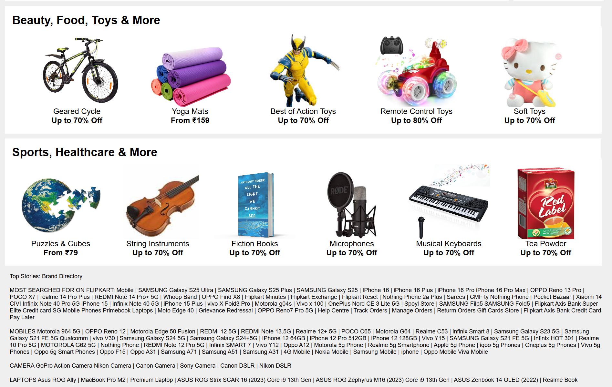
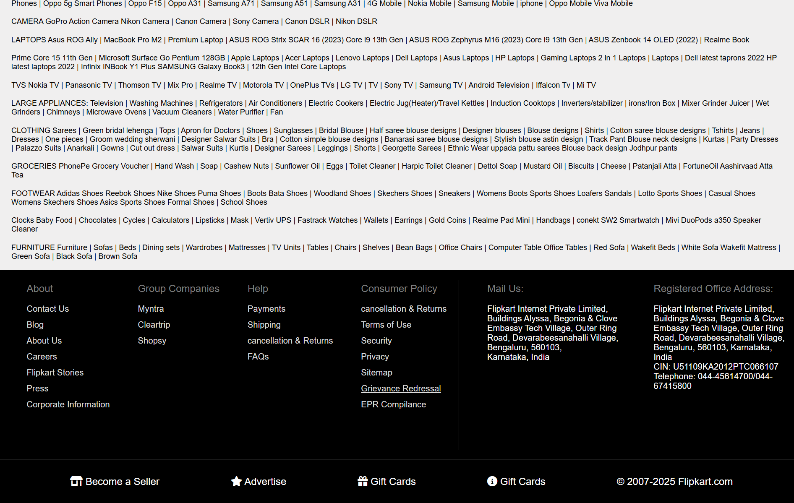

# Flipkart-Clone

This is a static front-end imitation of the Flipkart website, designed with **HTML** and **CSS**.

---

### 📌 NOTE:
For optimal viewing, please open the site in **Desktop Mode** if you're using a mobile phone.

---

### 🔗 [CLICK HERE TO OPEN](https://vidushi-coder.github.io/Flipkart-Clone/flipkart.html)

### 📸 Project Preview

---

  
  

  

